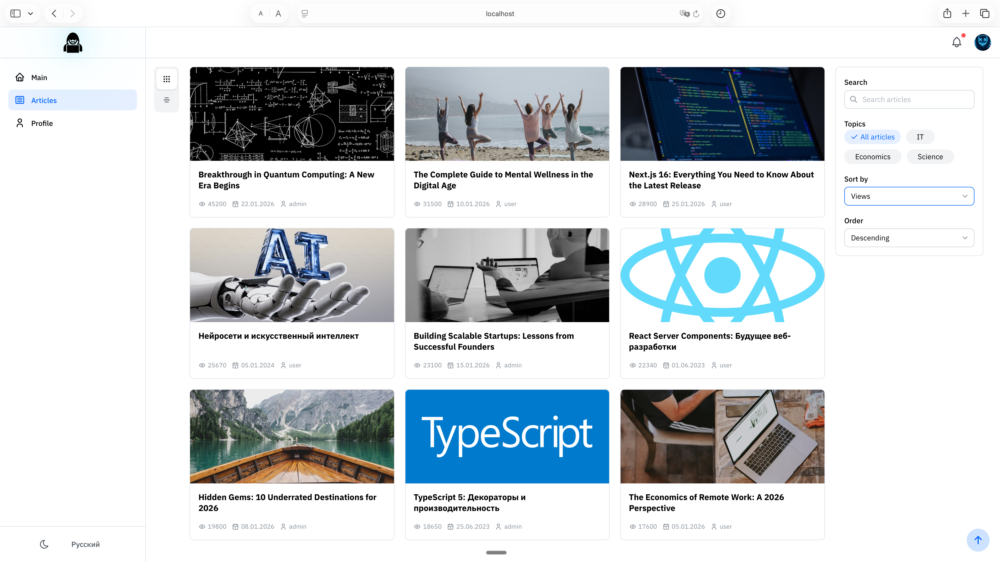

# ArticleSpace

A modern, production-ready blogging platform built with React and TypeScript. ArticleSpace enables users to create, publish, and discover articles with a rich text editor, user profiles, ratings, and social features.



**Live Demo:** [https://sprightly-speculoos-995581.netlify.app/](https://sprightly-speculoos-995581.netlify.app/)

---

## Features

- **Rich Article Editor** — Create and edit articles with a WYSIWYG editor powered by Tiptap
- **User Profiles** — Customizable profiles with avatars and rating systems
- **Article Discovery** — Browse, search, and filter articles by categories and tags
- **Comments & Ratings** — Engage with content through comments and star ratings
- **Internationalization** — Full i18n support (English & Russian)
- **Theme Switching** — Light and dark theme support
- **Notifications** — In-app notification system
- **Responsive Design** — Optimized for desktop and mobile devices

---

## Tech Stack

| Category | Technologies |
|----------|-------------|
| **Frontend** | React 18, TypeScript, Mantine v8 |
| **Backend** | Supabase (PostgreSQL, Auth, REST API) |
| **State Management** | Redux Toolkit, RTK Query |
| **Routing** | React Router v6 |
| **Rich Text Editor** | Tiptap |
| **Internationalization** | i18next, react-i18next |
| **Build Tools** | Vite (primary), Webpack |
| **Testing** | Jest, React Testing Library, Playwright |
| **Documentation** | Storybook |
| **Code Quality** | ESLint, Prettier, Stylelint, Husky |

---

## Getting Started

### Prerequisites

- Node.js 18+
- npm 9+

### Installation

1. **Clone the repository**
   ```bash
   git clone https://github.com/your-username/article-space.git
   cd article-space
   ```

2. **Install dependencies**
   ```bash
   npm install
   ```

3. **Configure Supabase**

   Copy `.env.example` to `.env` and fill in your Supabase credentials:
   ```bash
   cp .env.example .env
   ```

   Required variables:
   ```
   VITE_SUPABASE_URL=https://your-project.supabase.co
   VITE_SUPABASE_PUBLISHABLE_DEFAULT_KEY=your-publishable-key
   ```

4. **Start the development server**
   ```bash
   npm start
   ```

   This starts the frontend on port 3000. The backend is powered by Supabase (hosted).

5. **Open your browser**

   Navigate to [http://localhost:3000](http://localhost:3000)

### Demo Credentials

All demo accounts use the password: `123`

| Role | Username | Access Level |
|------|----------|--------------|
| **Admin** | `admin` | Full access to all features |
| **User** | `user` | Standard user access |
| **Manager** | `manager` | Manager-level access |
| **Test User** | `testuser` | Full access (testing) |

---

## Available Scripts

### Development

| Command | Description |
|---------|-------------|
| `npm start` | Start frontend (Vite) |
| `npm run start:dev` | Start frontend (Vite) in dev mode |
| `npm run start:dev:webpack` | Start frontend (Webpack) in dev mode |

### Build

| Command | Description |
|---------|-------------|
| `npm run build` | Production build (Vite) |
| `npm run build:dev` | Development build (Vite) |
| `npm run build:webpack` | Production build (Webpack) |

### Testing

| Command | Description |
|---------|-------------|
| `npm run test:unit` | Run unit tests with Jest |
| `npm run test:e2e` | Run end-to-end tests with Playwright |
| `npm run test:e2e:ui` | Run Playwright tests with UI |

### Code Quality

| Command | Description |
|---------|-------------|
| `npm run check` | Run TypeScript check + ESLint |
| `npm run lint:ts` | Check TypeScript files with ESLint |
| `npm run lint:ts:fix` | Fix ESLint issues automatically |
| `npm run lint:css` | Check CSS files with Stylelint |
| `npm run prettier` | Format all files with Prettier |

### Storybook

| Command | Description |
|---------|-------------|
| `npm run storybook` | Start Storybook on port 6006 |
| `npm run storybook:build` | Build Storybook for deployment |

### Code Generation

| Command | Description |
|---------|-------------|
| `npm run generate:slice` | Generate a new FSD slice |
| `npm run remove-feature` | Remove a feature flag |

---

## Project Structure

This project follows [Feature-Sliced Design (FSD)](https://feature-sliced.design/) methodology:

```
src/
├── app/                    # Application initialization, providers, global styles
│   ├── providers/          # Context providers (Store, Router, Theme)
│   └── styles/             # Global styles and CSS variables
│
├── pages/                  # Page components (route-level)
│   ├── ArticlesPage/       # Articles list page
│   ├── ArticleDetailsPage/ # Single article view
│   ├── ProfilePage/        # User profile
│   └── ...
│
├── widgets/                # Complex UI blocks composed of features/entities
│   ├── Navbar/             # Top navigation bar
│   ├── Sidebar/            # Side navigation
│   └── ...
│
├── features/               # User interactions and business logic
│   ├── AuthByUsername/     # Authentication feature
│   ├── articleRating/      # Article rating feature
│   ├── addCommentForm/     # Comment submission
│   └── ...
│
├── entities/               # Business entities
│   ├── Article/            # Article entity
│   ├── User/               # User entity
│   ├── Comment/            # Comment entity
│   └── ...
│
└── shared/                 # Reusable code
    ├── api/                # API configuration (RTK Query)
    ├── config/             # App configuration
    ├── lib/                # Utility functions and hooks
    └── ui/                 # UI component library
```

### Layer Import Rules

FSD enforces strict layer hierarchy. Each layer can only import from layers below it:

```
app → pages → widgets → features → entities → shared
```

---

## Configuration

| Path | Description |
|------|-------------|
| `vite.config.ts` | Vite configuration |
| `config/build/` | Webpack configuration |
| `config/jest/` | Jest test configuration |
| `config/storybook/` | Storybook configuration |
| `config/babel/` | Babel configuration |

### Environment

| Port | Service |
|------|---------|
| 3000 | Frontend dev server |
| 6006 | Storybook |

The backend is powered by [Supabase](https://supabase.com/) (hosted PostgreSQL with Auth, REST API, and Row Level Security).

---

## Internationalization

The project uses `i18next` for translations. Translation files are located in:

```
public/locales/
├── en/           # English translations
│   ├── translation.json
│   ├── article.json
│   └── ...
└── ru/           # Russian translations
    ├── translation.json
    ├── article.json
    └── ...
```

---

## Contributing

1. Fork the repository
2. Create your feature branch (`git checkout -b feature/amazing-feature`)
3. Commit your changes (`git commit -m 'Add some amazing feature'`)
4. Push to the branch (`git push origin feature/amazing-feature`)
5. Open a Pull Request

Please ensure your code passes all linting and tests before submitting.

---

## License

This project is licensed under the ISC License.
